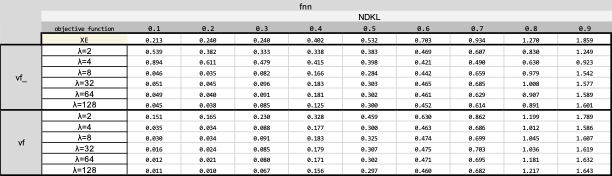

# <p align="left"></p> Mitigating Gender Bias in Neural Team Recommendation via Female-Advocate Loss Regularization


As modern tasks have been surpassing the capacity of individuals, collaborative teams of experts have become vital in today's diverse landscape across academia, industry, law, freelancing, and healthcare. The team recommendation problem, also known as team allocation, team selection, team composition, and team configuration, seeks to automate the assembly of experts in a team whose combined skills solve challenging tasks. Team recommendation can be seen as social information retrieval (Social IR), where the right group of experts, rather than relevant information, is required to accomplish the task at hand. Traditionally, even now in many scientific and industrial sectors, teams have been formed manually by relying on human experience and instinct, a process that is tedious, error-prone, and suboptimal due to hidden personal and societal biases, a multitude of criteria to optimize, and an overwhelming number of candidates, among other reasons. Notably, the team formation has been heavily influenced by the individuals' subjective opinions which inherit hidden and unfair societal biases, largely ignoring the diversity in recommending expert members of a team, resulting in discrimination and reduced visibility for already disadvantaged female experts, disproportionate selection of male experts, and gender disparities. 

<table border=0>
<tr>
<td >

  
- [1. Setup](#1-setup)
- [2. Quickstart](#2-quickstart)
- [3. Features](#3-features)
  * [`Fairness aware Team Formation`](#31-adila-fairness-aware-team-formation)
  * [`Datasets and Parallel Preprocessing`](#32-datasets-and-parallel-preprocessing)
  * [`Non-Temporal Neural Team Formation`](#33-non-temporal-neural-team-formation)
  * [`Model Architecture`](#35-model-architecture)
  * [`Negative Sampling Strategies`](#36-negative-sampling-strategies)
  * [`Run`](#37-run)
- [4. Results](#4-results)
- [5. Acknowledgement](#5-acknowledgement)


</td>
<td></td>
<!-- <td></td> -->
</tr>
</table>


## 1. Setup
You need to have ``Python >= 3.8`` and install the following main packages, among others listed in [``requirements.txt``](requirements.txt):
```
torch>=1.9.0
pytrec-eval-terrier==0.5.2
gensim==3.8.3
```

For installation of specific version of a python package due to, e.g., ``CUDA`` versions compatibility, one can edit [``requirements.txt``](requirements.txt) or [``environment.yml``](environment.yml) like as follows:

```
# CUDA 10.1
torch==1.6.0+cu101 -f https://download.pytorch.org/whl/torch_stable.html
```
## 2. Quickstart

```sh
cd src
python -u main.py -data ../data/raw/imdb/toy.dblp.v12.json -domain imdb -model fnn (or bnn) -filter 1 -augment 1
```

The above run, loads and preprocesses a tiny-size toy example dataset [``toy.dblp.v12.json``](data/raw/dblp/toy.dblp.v12.json) from [``dblp``](https://originalstatic.aminer.cn/misc/dblp.v12.7z) followed by _n_-fold train-evaluation on a training split and final test on the test set for ``feedforward`` and ``Bayesian`` neural models using default hyperparameters from [``./src/param.py``](./src/param.py). To change the loss function that the model uses, from [``./src/param.py``](./src/param.py) change the hyperparameter ns to 'vf' or 'vf_' in the models's setting(fnn,bnn) and for training the model with the cross-entropy loss function replace it with 'none'.

```
python -u main.py -data ../data/raw/imdb/toy.dblp.v12.json -domain imdb -model fnn (or bnn) -filter 1 -augment 1
```

This script loads and preprocesses the same dataset [``toy.dblp.v12.json``](data/raw/dblp/toy.dblp.v12.json) from [``dblp``](https://originalstatic.aminer.cn/misc/dblp.v12.7z), takes the teams from the the last year as the test set and trains the ``Bayesian`` neural model following our proposed streaming training strategy as explained in ``3.2.2. Temporal Neural Team Formation`` with two different input representations _i_) sparse vector represntation and _ii_) temporal skill vector represntation using default hyperparameters from [``./src/param.py``](./src/param.py).

## 3. Features
#### **3.1. vivaFemme

Neural team recommendation has brought state-of-the-art efficacy while enhancing efficiency at forming teams of experts whose success in completing complex tasks is almost surely guaranteed. Yet proposed methods overlook diversity; that is, predicted teams are male-dominated and female participation is scarce. To this end, pre- and post-processing debiasing techniques have been initially proposed, mainly for being model-agnostic with little to no modification to the model's architecture. However, their limited mitigation performance has proven futile, especially in the presence of extreme bias, urging further development of \textit{in}-process debiasing techniques. In this paper, we are the first to propose an in-process gender debiasing method in neural team recommendation via a novel modification to models' conventional cross-entropy loss function. Specifically, (1) we dramatically penalize the model (i.e., an increase to the loss) for false negative female experts, and meanwhile, (2) we randomly sample from female experts and reinforce the likelihood of female participation in the predicted teams, even at the cost of increasing false positive females.


<p align="center"></p>


#### **3.2. Datasets and Parallel Preprocessing**

Raw dataset, e.g., scholarly papers from AMiner's citation network dataset of [``dblp``](https://originalstatic.aminer.cn/misc/dblp.v12.7z), movies from [``imdb``](https://datasets.imdbws.com/), or US patents from [``uspt``](https://patentsview.org/download/data-download-tables) were assumed to be populated in [``data/raw``](data/raw). For the sake of integration test, tiny-size toy example datasets [``toy.dblp.v12.json``](data/raw/dblp/toy.dblp.v12.json) from [``dblp``](https://originalstatic.aminer.cn/misc/dblp.v12.7z), [[``toy.title.basics.tsv``](data/raw/imdb/toy.title.basics.tsv), [``toy.title.principals.tsv``](data/raw/imdb/toy.title.principals.tsv), [``toy.name.basics.tsv``](data/raw/imdb/toy.name.basics.tsv)] from [``imdb``](https://datasets.imdbws.com/) and [``toy.patent.tsv``](data/preprocessed/uspt/toy.patent.tsv) have been already provided.

<p align="center"></p>

Raw data will be preprocessed into two main ``sparse`` matrices each row of which represents: 

>i) ``vecs['member']``: occurrence (boolean) vector representation for members of a team, e.g., authors of a paper or crew members of a movie,
> 
>ii) ``vecs['skill']``: occurrence (boolean) vector representation for required skills for a team, e.g., keywords of a paper or genre of a movie.

Also, indexes will be created to map the vector's indexes to members' names and skills' names, i.e., ``i2c``, ``c2i``, ``i2s``, ``s2i``.

The sparse matrices and the indices will be persisted in [``data/preprocessed/{dblp,imdb,uspt}/{name of dataset}``](data/preprocessed/) as pickles ``teamsvecs.pkl`` and ``indexes.pkl``. For example, the preprocessed data for our dblp toy example are [``data/preprocessed/dblp/toy.dblp.v12.json/teamsvecs.pkl``](data/preprocessed/dblp/toy.dblp.v12.json/teams.pkl) and [``data/preprocessed/dblp/toy.dblp.v12.json/indexes.pkl``](data/preprocessed/dblp/toy.dblp.v12.json/indexes.pkl).

> Our pipeline benefits from parallel generation of sparse matrices for teams that significantly reduces the preprocessing time as shown below:
> 
> <p align="center"></p>


Please note that the preprocessing step will be executed once. Subsequent runs load the persisted pickle files. In order to regenerate them, one should simply delete them. 


#### **3.3. Non-Temporal Neural Team Formation**

We randomly take ``85%`` of the dataset for the train-validation set and ``15%`` as the test set, i.e., the model never sees these instances during training or model tuning. You can change ``train_test_split`` parameter in [``./src/param.py``](./src/param.py).


<p align="center"></p>


#### **3.4. Model Architecture**

Each model has been defined in [``./src/mdl/``](./src/mdl/) under an inheritance hierarchy. They override abstract functions for ``train``, ``test``, ``eval``, and ``plot`` steps.

For example, for our feedforward baseline [``fnn``](./src/mdl/fnn.py), the model has been implemented in [``./src/mdl/fnn.py``](src/mdl/fnn.py). Model's hyperparameters such as the learning rate (``lr``) or the number of epochs (``e``) can be set in [``./src/param.py``](src/param.py).


<p align="center"></p>
  
Currently, we support neural models:
1) Bayesian [``bnn``](./src/mdl/bnn.py) where model's parameter (weights) is assumed to be drawn from Gaussian (Normal) distribution and the task is to not to learn the weight but the mean (μ) and standard deviation (σ) of the distribution at each parameter.

<p align="center"></p>

2) non-Bayesian feedforward [``fnn``](./src/mdl/fnn.py) where the model's parameter (weights) is to be learnt.

The input to the models is the vector representations for (_temporal_) skills and the output is the vector representation for members. In another word, given the input skills, the models predict the members from the pool of candidates. We support three vector representations:

i) Sparse vector representation (occurrence or boolean vector): See preprocessing section above.

ii) Dense vector representation ([``team2vec``](src/mdl/team2vec/team2doc2vec.py)): Inspired by paragraph vectors by [Le and Mikolov](https://cs.stanford.edu/~quocle/paragraph_vector.pdf), we consider a team as a document and skills as the document words (``embtype == 'skill'``). Using distributed memory model, we map skills into a real-valued embedding space. Likewise and separately, we consider members as the document words and map members into real-valued vectors (``embtype == 'member'``). We also consider mapping skills and members into the same embedding space (``embtype == 'joint'``). Our embedding method benefits from [``gensim``](https://radimrehurek.com/gensim/) library.

iii) Temporal skill vector represntation ([``team2vec``](src/mdl/team2vec/team2doc2vec.py)): Inspired by [Hamilton et al.](https://aclanthology.org/P16-1141/), we also incorporate time information into the underlying neural model besides utilizing our proposed streaming training strategy. We used the distributed memory model of Doc2Vec to generate the real-valued joint embeddings of the subset of skills and time intervals, where the skills and time intervals are the words of the document (``embtype == 'dt2v'``).

3) In OpeNTF2, The ``Nmt`` wrapper class is designed to make use of advanced transformer models and encoder-decoder models that include multiple ``LSTM`` or ``GRU`` cells, as well as various attention mechanisms. ``Nmt`` is responsible for preparing the necessary input and output elements and invokes the executables of ``opennmt-py`` by creating a new process using Python's ``subprocess`` module. Additionally, because the ``Nmt`` wrapper class inherits from ``Ntf``, these models can also take advantage of temporal training strategies through ``tNtf``.

#### **3.5. Negative Sampling Strategies**

As known, employing ``unsuccessful`` teams convey complementary negative signals to the model to alleviate the long-tail problem. Most real-world training datasets in the team formation domain, however, do not have explicit unsuccessful teams (e.g., collections of rejected papers.) In the absence of unsuccessful training instances, we proposed negative sampling strategies based on the ``closed-world`` assumption where no currently known successful group of experts for the required skills is assumed to be unsuccessful.  We study the effect of ``three`` different negative sampling strategies: two based on static distributions, and one based on adaptive noise distribution:

1) Uniform distribution (``uniform``), where subsets of experts are randomly chosen with the ``same probability`` as unsuccessful teams from the uniform distribution over all subsets of experts.

2) Unigram distribution (``unigram``), where subsets of experts are chosen regarding ``their frequency`` in all previous successful teams. Intuitively, teams of experts that have been more successful but for other skill subsets will be given a higher probability and chosen more frequently as a negative sample to dampen the effect of popularity bias.

3) Smoothed unigram distribution in each training minibatch (``unigram_b``), where we employed the ``add-1 or Laplace smoothing`` when computing the unigram distribution of the experts but in each training minibatch. Minibatch stochastic gradient descent is the _de facto_ method for neural models where the data is split into batches of data, each of which is sent to the model for the partial calculation to speed up training while maintaining high accuracy. 

To include a negative sampling strategy, there are two parameters for a model to set in [``./src/param.py``](src/param.py):
- ``ns``: the negative sampling strategy which can be ``uniform``, ``unigram``, ``unigram_b`` or ``None``(no negative sampling).
- ``nns``: number of negative samples

#### **3.6. Run**

The pipeline accepts three required list of values:
1) ``-data``: the main file of a dataset, e.g., ``-data ./../data/raw/imdb/title.basics.tsv``
2) ``-domain``: list of domains of the raw data files that could be  ``imdb``; e.g., ``-domain imdb``.
3) ``-model``: list of baseline models that could be ``fnn``, ``bnn``; e.g., ``-model fnn bnn``.


## 4. Results

We used [``pytrec_eval``](https://github.com/cvangysel/pytrec_eval) to evaluate the performance of models on the test set as well as on their own train sets (should overfit) and validation sets. We report the predictions, evaluation metrics on each test instance, and average on all test instances in ``./output/{dataset name}/{model name}/{model's running setting}/``.  For example:

1) ``f0.test.pred`` is the predictions per test instance for a model which is trained folds [1,2,3,4] and validated on fold [0].
2) ``f0.test.pred.eval.csv`` is the values of evaluation metrics for the predictions per test instance
3) ``f0.test.pred.eval.mean.csv`` is the average of values for evaluation metrics over all test instances.
4) ``test.pred.eval.mean.csv`` is the average of values for evaluation metrics over all _n_ fold models.

**Benchmarks at Scale**

**1. Fair Team Formation Results**
||min. #member's team: 75, min team size: 3, epochs: 20, learning rate: 0.1, hidden layer: [1, 100d], minibatch: 4096, #negative samples: 3|
|--------|------|
|Datasets| [imdb](https://imdb.com/interfaces/)|
|Metrics|ndkl, map@2,5,10, ndcg@2,5,10, auc|
|Sensitive Attributes| gender|
|Baselines|{bnn, fnn}|

The following table is a sample result of vivaFemme on imdb dataset and bnn and fnn embedding baseline:

<p align="center"></p>
<p align="center"></p>

<p align="center"></p>
<p align="center"></p>
